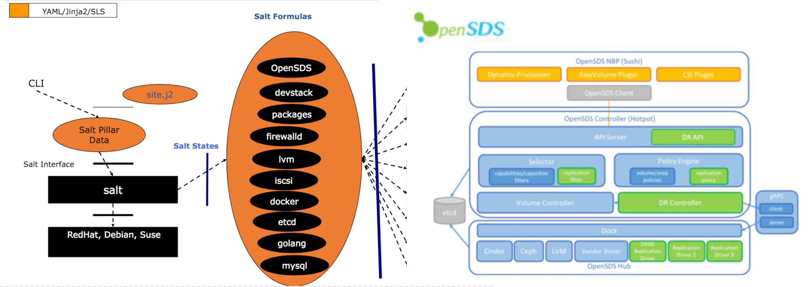

============
soda-formula
============

Deploy official releases of SodaFoundation (www.sodafoundation.io) using Salt on CENTOS, UBUNTU, and OPENSUSE. It's an experimental solution using repeatable dictionary patterns to deploy cloud-native stack using infrastructure as code.  This formula compliments the SodaFoundation-Installer_ project.

.. _SodaFoundation-Installer: https://github.com/sodafoundation/installer

.. notes::

    See the full `Salt Formulas installation and usage instructions
    <http://docs.saltstack.com/en/latest/topics/development/conventions/formulas.html>`_.

Architectural View
===================

Available META states
======================

.. contents::
    :local:

``soda``
--------

Runs all the other states in the formula. Used by the ``SodaFoundation-installer/salt`` module.

``soda.infra``
--------------

Deploy os profile (PATHS) and environmental dependencies (packages, nginx, docker, etc) via salt.

``soda.telemetry``
------------------

Deploy prometheus and grafana via salt.

``soda.keystone``
-----------------

Deploy devstack with keystone configuration for controller and multicloud.

``soda.config``
---------------

Deploy Soda configuration file

``soda.controller``
-------------------

Deploy Soda controller

``soda.auth``
-------------

Deploy authentication service (default keystone).

``soda.database``
-----------------

Deploy database service (default etcd).

``soda.dock``
-------------

Deploy Dock service.

``soda.nbp``
------------

Deploy north bound plugin service.

``soda.multicloud``
-------------------

Deploy multicloud service.

``soda.dashboard``
-----------------

Deploy Dashboard service.

``soda.freespace``
-----------------

Free some disk space

Site-specific Data Collection
=============================

The ``site.j2`` and ``pillar.example`` files contain required pillars!

You may review and cautiously update ``site.j2`` to reflect site requirements and preferences.

Prerequisite
==============

Prepare your environment by running the ``salt.formulas`` state from ``https://github.com/saltstack-formulas/salt-formula``. See ``pillar.example`` and/or sodafoundation/installer/salt README.
